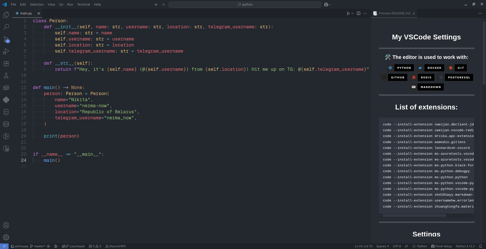

# VSCode Settings

My minimal editor configuration for daily development

## Core Technologies


## Essential Extensions

```bash
code --install-extension cweijan.dbclient-jdbc
code --install-extension cweijan.vscode-redis-client
code --install-extension drcika.apc-extension
code --install-extension eamodio.gitlens
code --install-extension leonardssh.vscord
code --install-extension ms-azuretools.vscode-containers
code --install-extension ms-azuretools.vscode-docker
code --install-extension ms-python.black-formatter
code --install-extension ms-python.debugpy
code --install-extension ms-python.python
code --install-extension ms-python.vscode-pylance
code --install-extension ms-python.vscode-python-envs
code --install-extension shd101wyy.markdown-preview-enhanced
code --install-extension usernamehw.errorlens
code --install-extension zhuangtongfa.material-theme
```

## Editor settings (settings.json)

```json
{
    // Terminal
    "terminal.integrated.env.windows": {},
    "terminal.integrated.smoothScrolling": true,
    "terminal.integrated.fontFamily": "GeistMono Nerd Font",
    "terminal.integrated.fontSize": 12,
    // Edtor
    "editor.fontFamily": "GeistMono Nerd Font",
    "editor.inlayHints.fontFamily": "GeistMono Nerd Font",
    "editor.codeLensFontFamily": "GeistMono Nerd Font",
    "editor.fontSize": 18,
    "editor.tabSize": 4,
    "editor.formatOnSave": true,
    "editor.renderWhitespace": "all",
    "editor.minimap.enabled": false,
    "editor.renderLineHighlight": "none",
    "editor.scrollbar.horizontal": "hidden",
    "editor.scrollbar.vertical": "hidden",
    "editor.scrollbar.horizontalScrollbarSize": 2,
    "editor.scrollbar.verticalScrollbarSize": 2,
    "editor.cursorSmoothCaretAnimation": "on",
    "editor.inlineSuggest.enabled": true,
    "editor.stickyScroll.enabled": false,
    "editor.smoothScrolling": true,
    "editor.fontLigatures": true,
    "editor.cursorStyle": "block",
    "editor.cursorBlinking": "solid",
    "editor.accessibilitySupport": "off",
    // Files
    "files.autoSave": "afterDelay",
    "files.insertFinalNewline": true,
    // Explorer
    "explorer.confirmDragAndDrop": false,
    "explorer.confirmDelete": false,
    // Breadcrumbs
    "breadcrumbs.enabled": false,
    // Workbench
    "workbench.layoutControl.enabled": false,
    "workbench.list.smoothScrolling": true,
    "workbench.colorTheme": "One Dark Pro Darker",
    "workbench.startupEditor": "none",
    //"workbench.settings.editor": "json",
    // Scm
    "scm.inputFontFamily": "GeistMono Nerd Font",
    // Chat
    "chat.editor.fontFamily": "GeistMono Nerd Font",
    // Debug
    "debug.console.fontFamily": "GeistMono Nerd Font",
    // Markdown
    "markdown.preview.fontFamily": "GeistMono Nerd Font",
    "markdown-preview-enhanced.revealjsTheme": "moon.css",
    "markdown-preview-enhanced.previewTheme": "one-dark.css",
    // Window
    "window.customTitleBarVisibility": "never",
    // Discord RPC
    "vscord.status.idle.check": false,
    "vscord.app.name": "Visual Studio Code",
    "vscord.status.idle.disconnectOnIdle": false,
    "vscord.status.idle.enabled": false,
    "python.defaultInterpreterPath": "/bin/python3",
    // Mouse
    "editor.mouseWheelZoom": true,
    // Python Formatter
    "[python]": {
        "editor.defaultFormatter": "ms-python.black-formatter",
        "editor.formatOnSave": true,
    },
    // Files Exclude
    "files.exclude": {
        "**/__pycache__": true
    }
}
```

## Keybindings (keybindings.json)

```json
[
    {
        "key": "f10",
        "command": "python.execInTerminal-icon"
    },
    {
        "key": "ctrl+alt+f",
        "command": "explorer.newFolder"
    }
]
```

## Screenshot


